# **Javascript**
- To print something in the console we use console.log();
- ## Variables
    - Variables are used to store some information and now we use this information later on, we can also change the information stored inside variable.

    - In JS we can use `var`, `let`, `const` to declare variables.
    - Rules for naming variables
        - Can't start a variable with a name with a number

        - Can't use spaces in variable names
        - `$` and ` _ ` are the symbols allowed in variable names
    - Convention - camelCase convention is generally followed in JS
    - Difference between `var`, `let` and `const`
    - |             |   Redeclare   |   Reassign    |   Scope       |   Temporal Dead Zone    
      | :---:       |   :---        |   :---        |   :---        |   :---
      | **var**     |   Possible    |   Possible    |   Function    |   No
      | **let**     |   Not Possible|   Possible    |   Block       |   Yes
      | **const**   |   Not Possible|   Not Possible|   Block       |   Yes
---
- ## Primitive Data Types
    - string
    
    - number
    - boolean
    - undefined
    - null
    - bigInt 
    - Symbol
    - `typeof` operator : Used to check the data type of the variable
    - 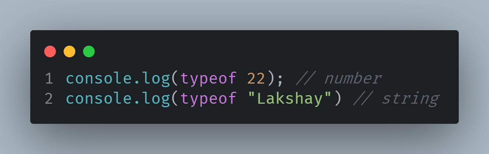
    - ***Important Thing to know***
    - 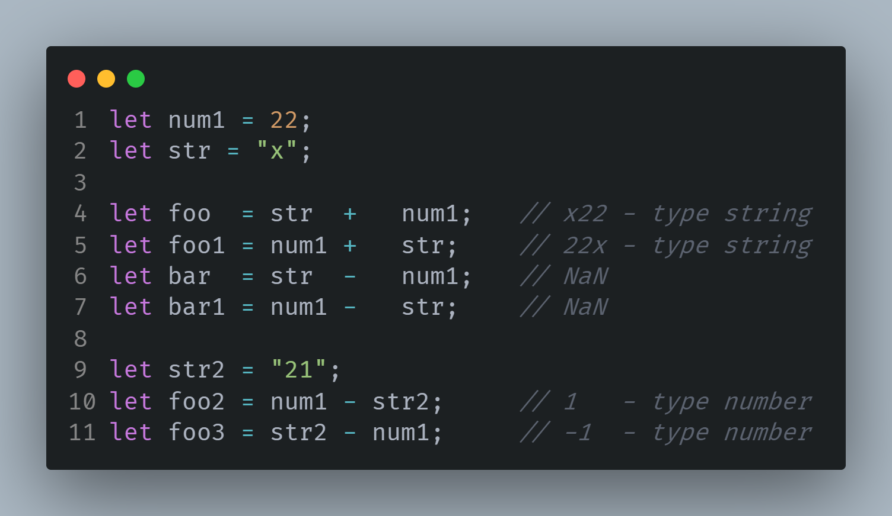
    - In JS when `+` is used between a number and string the number is automatically converted to string and a new string is created after concatenation, whereas in case of `-` if the string only contains numbers then it is converted to number else as it shows NaN i.e not a number
---

- ## Strings
    - In JS we can use string inside double quotes `("")`, inside single quotes `('')` or inside string template literals `(``)`
    - Indexing in String starts from 0. Example string `let str = "Lakshay"`

    - L a k s h a y
    - 0 1 2 3 4 5 6
    - Length of this string is 7
    - We can get the length by `str.length` = 7
    - Last Index = length-1
    - We can also get the char a at particular index by `str[2] = 'k'`
    - ### Some useful string methods
        - |  Method    | What it does     |
          | :--- | :--- |
          |[trim()](https://developer.mozilla.org/en-US/docs/Web/JavaScript/Reference/Global_Objects/String/Trim)| Returns a new string after removing the extra spaces from the start and end of the string| 
          |[toUpperCase()](https://developer.mozilla.org/en-US/docs/Web/JavaScript/Reference/Global_Objects/String/toUpperCase)| Returns a new string after converting all character inside the string to upper case|
          |[toLowerCase()](https://developer.mozilla.org/en-US/docs/Web/JavaScript/Reference/Global_Objects/String/toLowerCase)| Returns a new string after converting all character inside the string to lower case|
          |[substring()](https://developer.mozilla.org/en-US/docs/Web/JavaScript/Reference/Global_Objects/String/toLowerCase)| Returns the part of the string between the start and end indexes, or to the end of the string|
    - String concatenation : We can add one string at the end of another using `+`
    - 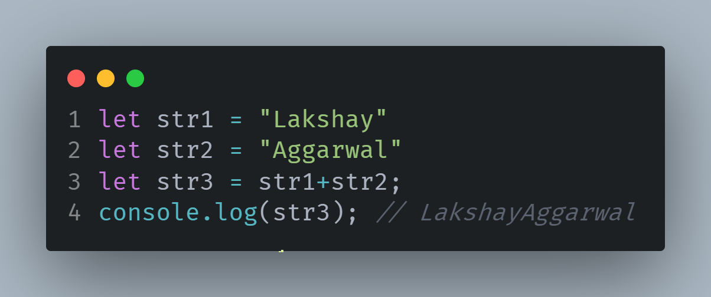
    - Template Literals : In JS we can write string inside `` now benefit of using this is that we can directly use variable names in this string and it will automatically substitute its value in the string. We put variable names in ${varName here}
    - 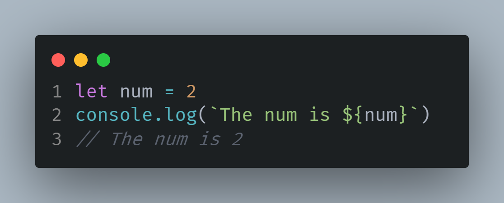  
---
- ## Boolean, BigInt, undefined and null
    - boolean is value that is either `true` or `false`
    - undefined is something in that exists in the memory but has not been assigned any memory to it yet
    - null is something that is non existent

    - ***There is a bug in JS that shows the `typeof null` as `object` and this can't be fixed as there are millions of repositories that are using this and if this is fixed then every one of those repositories need to be refactored accordingly***
    - BigInt : This is one of the newer additions in JS we can declare a BigInt as `let x = BigInt(2)` or `let x = 2n` in both of these cases `typeof x = BigInt`. **Note:** We cannot perform operations between numbers and BigInt
    
--- 
- ## Comparison and Logical Operators
    - [Comparators](https://www.w3schools.com/js/js_comparisons.asp)
    
    - |Operator |   Meaning                 |
      |:---:    |   :---:                   |
      | >       |   greater than            |
      | >=      |   greater than or equal to|
      | <       |   less than               |
      | <=      |   lees than or equal to   |
      | ==      |   equal to                |
      | ===     |   strict equal to         |
      | !=      |   not equal to            |
      | !==     |   strict not equal to     |
    
    - Difference between == and ===
        - `5 == "5" is true` as it does not compare the data types and only compares the value
        - `5 === "5" is false` as it compares both the data type as well as the data value
    - Difference between != and !==
        - `5 != "5" is false` as it compares only value so 5 and 5 are equal hence it shows false
        - `5 !== "5" is true` as it compares both the data type and value
    - [Logical operators]()
    - `&&` **and operator** : returns true only when all the conditions satisfy
    - `||` **or operator**  :   returns true when any of the conditions satisfies
    - `!`  **not operator** : return true for false and false for true
---
- ## Falsy & Truthy
    
    - Value that is considered false (in boolean context) when encountered list of falsy/falsey values.
        - `false`
        - `""` (i.e empty string)
        - `0`
        - `-0`
        - `0n`
        - `undefined`
        - `null`
        - `NaN`
    - Any value that is not falsy is truthy (true in boolean context)
---
- ## Ternary Operators
    - `Condition?A:B` : Now this statement will execute A if the condition is true else it will execute statement B
    - 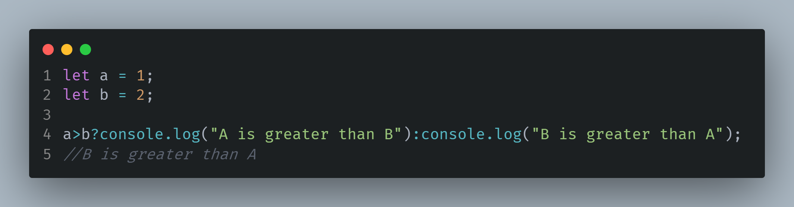

---
- ## [If else in JS](https://www.w3schools.com/js/js_if_else.asp)
- ## [Switch in JS](https://www.w3schools.com/js/js_switch.asp)
- ## [Loops in JS (Read for, while, do while) ](https://www.w3schools.com/js/js_loop_for.asp)
    - `break` statement terminates the loop i.e it jumps out of the loop.
    - `continue` statement jumps one iteration in the loop 
---
- # Arrays
    - Ordered collection of elements
    - It is a ***reference data type***

    - Since arrays are a reference data type so it is mutable
    - `let fruits = [🍇,🍉,🍊,🍋,🍌,🍍,🍎,🍑]`
    - Ordered collection means arrays are indexed starting from index 0
    - In JS we can store different types of data types/ objects inside one array
    - `typeof fruits = object`
    - To check if fruits is an array only we should do `Array.isArray(fruits) = true`
    - ## Basic Array Methods
        - 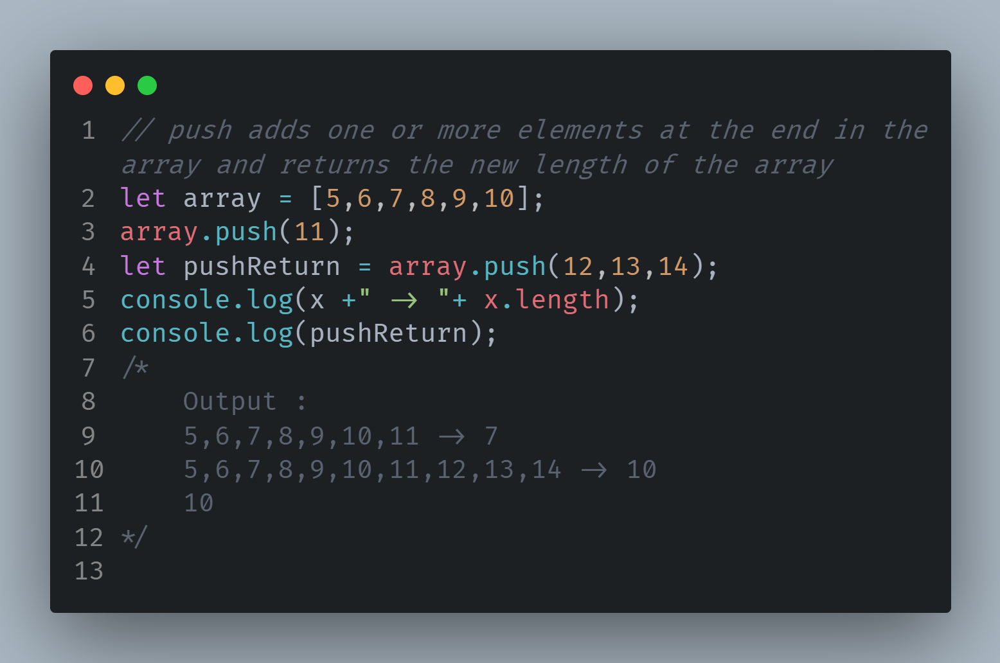 
        - 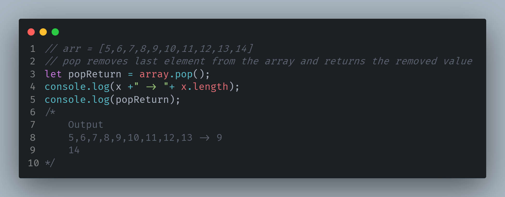
        - 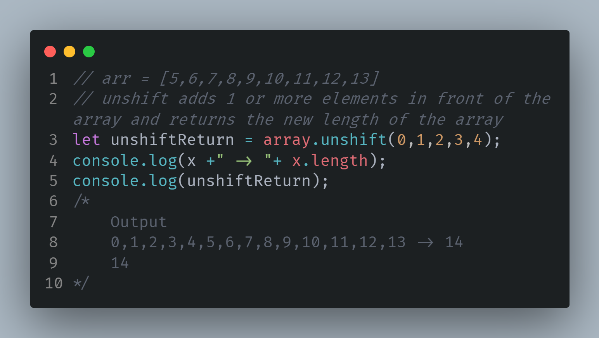
        - 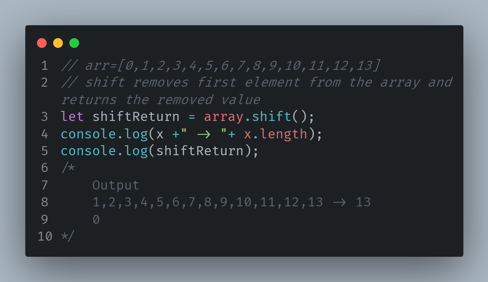
        - [Push, pop, unshift, shift](./Arrays/1_push_pop.js)
        - ***Push and Pop are comparatively faster than unshift and shift when working with large array's***
    - ## Meaning of reference data types
        - In simple terms reference data types store the actual data inside the heap and the variable is assigned a pointer pointing to location of that data in the heap.
        - `let a = [1,2,3,4,5]` this is how it is inside the memory
        - 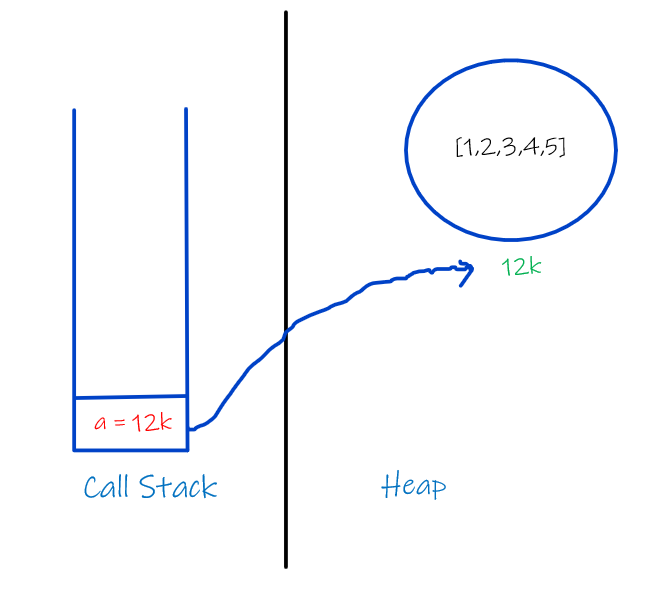
        
        - If we do `let b = a` and then update `a` or `b` then that change will be reflected in both the arrays `a` and `b` because both of them are pointing to the same thing(`object`) inside heap.
        - 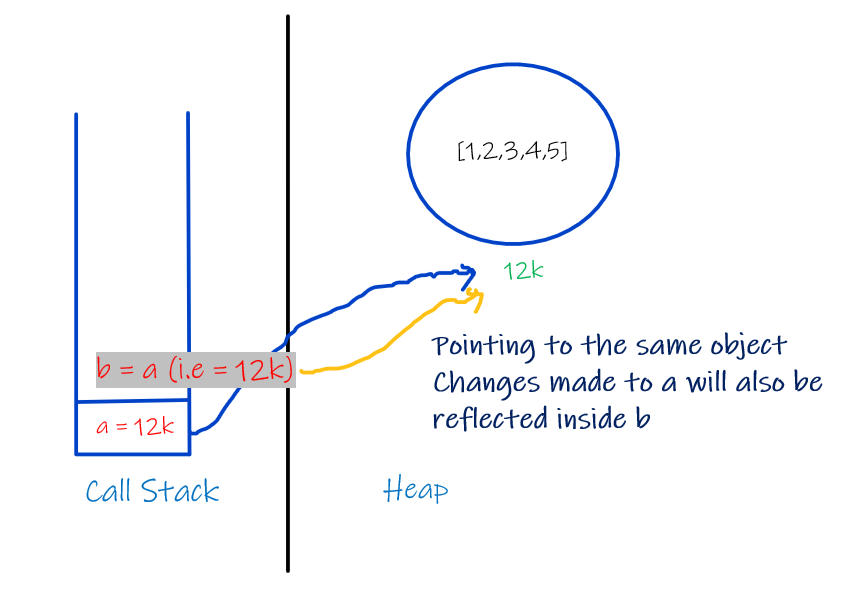

    - ## How to clone Arrays ?
        - Method 1: `let b = a.slice(0)`. Since [slice](./Arrays/5_slice.js) array returns a new array from the index passed to it till the end, so this method will create a new reference inside the heap for array b.

        - Method 2: `let b = [].concat(a)`.
        - Method 3: `let b = [...a]`. Is this known as spread operator and is the most used way. `...`/`spread operator` creates a coma separated list and when used inside `[]` square brackets it creates a new array using that list and hence a new reference inside the heap is created for `b`(in this case) 
    - **Most of the developers use const when creating arrays as all the methods like push pop etc still works normally. This happens because array are reference data types and reference data types stores the address inside the heap where the data of the array is actually present. That's why when we do `const arr = [1,2,3]` we cant do `arr=[]` since this is an assignment and we are creating a new array object inside the heap and assigning a new pointer to the `arr` but we can do `arr.pop()` or `arr.push` as we are changing the data present inside the heap and not the `arr`'s reference to that location** 
    - ## For of and For in Loops
        -   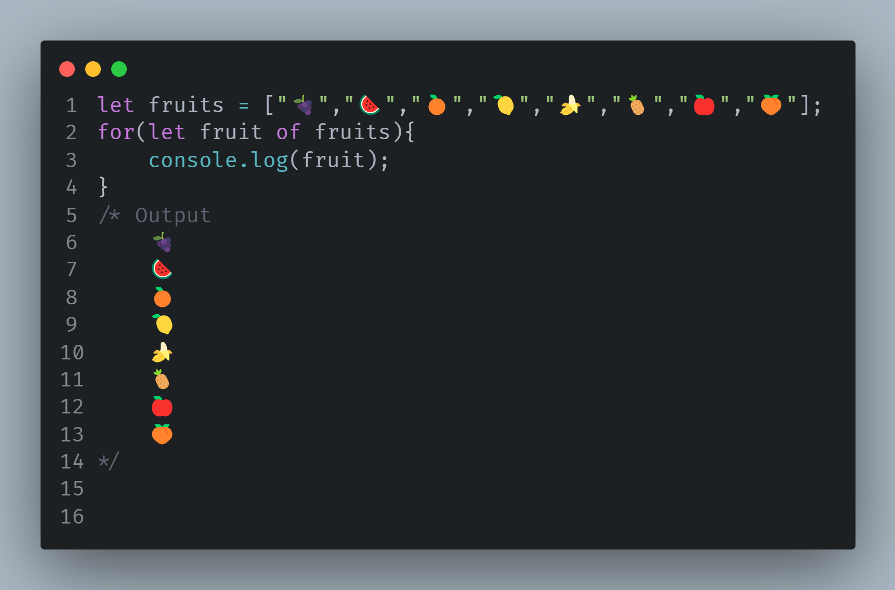
        -   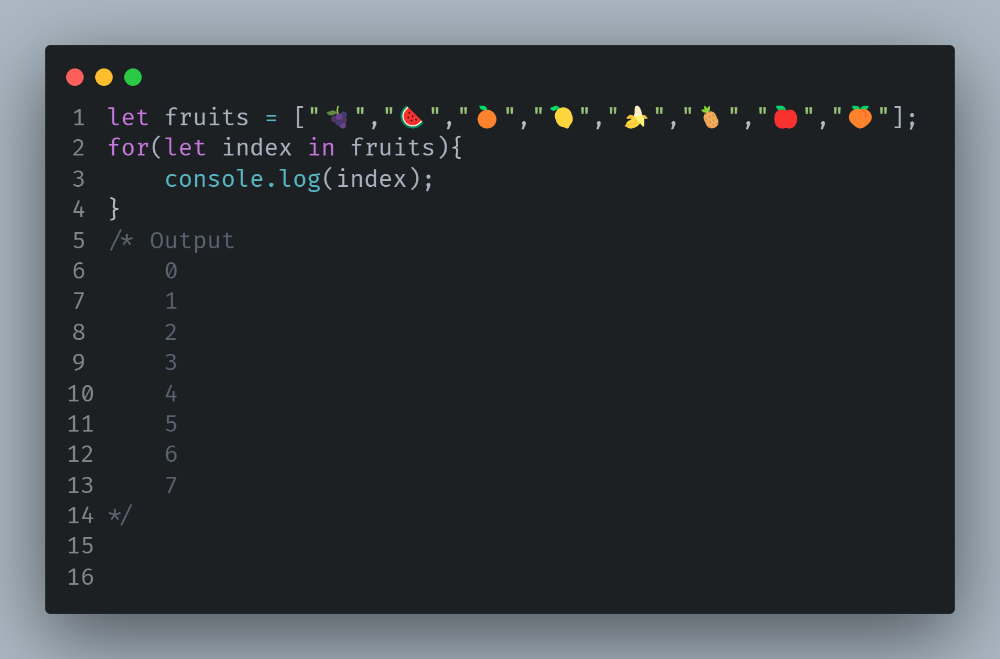

        -   Difference between for of and for in loop is that `for of` gives the elements of the array where as `for in` gives the index.
    - ## Array Destructuring
        - Mostly used in react
        - Most of the time when we want elements from array we do `let x = a[0]` and we get the 0th element, but there is a shortcut in JS for this.

        - We can do `let [x1] = a`, where `a` is an array, this will get the 0th element of `a` in `x1`.
        - 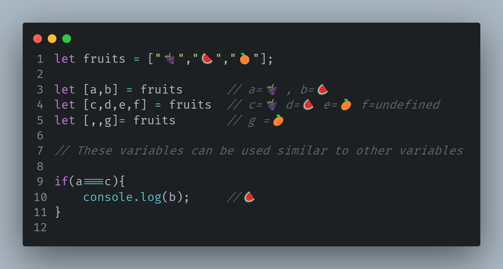
---
- # Objects
    - Objects are also reference data types
    - Stores values in key:value pairs

    - Objects does not have index 
    - Object are created using `{}` brackets
    - 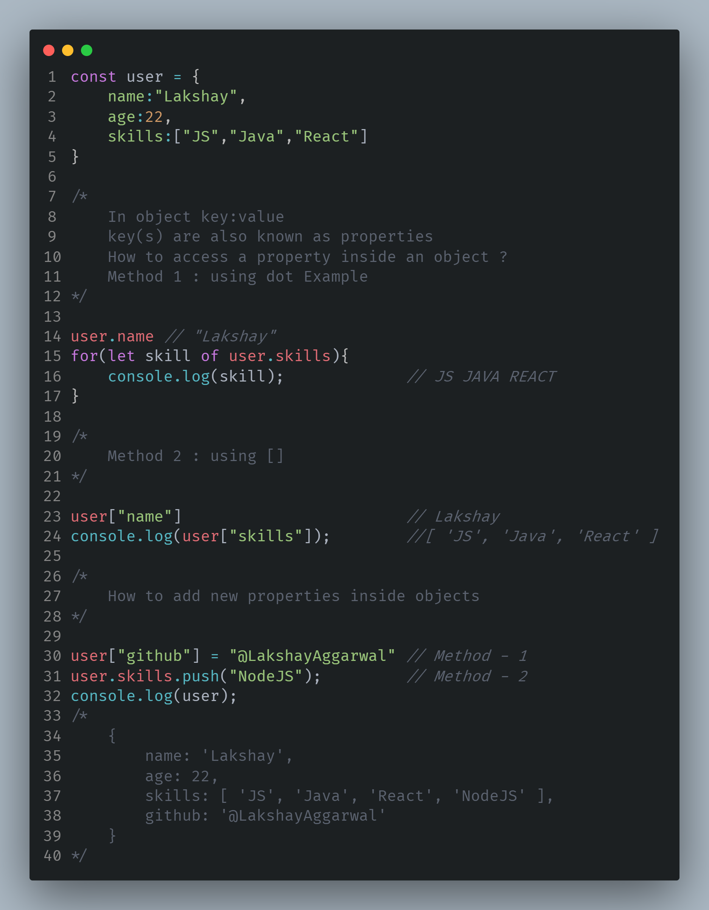
    - Key(s)/Properties inside object should be unique and if a key is repeated in an object then the value of the key written later will overwrite the value of the previous key having the same name.
    - ## How to Loops through objects
        - using for in Loop
        - 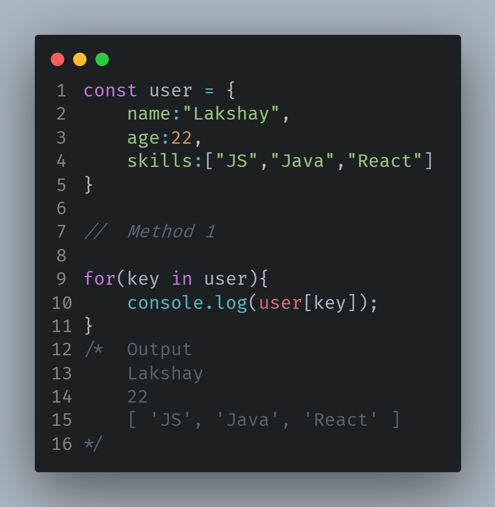
    - ## We can clone an object by using spread operators similarly to how it is done in case of arrays.
    
    - ## Object Destructing 
        -   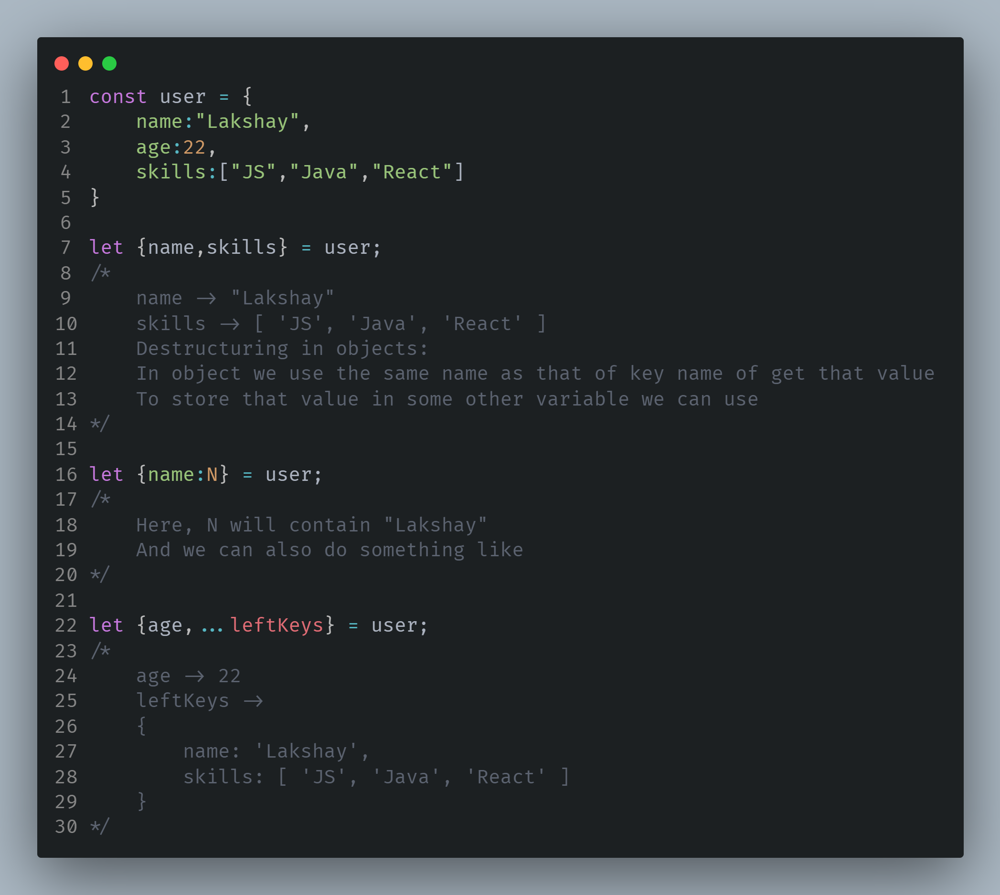
 ---
- # Functions
    - Set of statements that performs a task but for this set of statements to be qualified as a function it should take some input and  produce output where there is some obvious relationship between the input and output.
    - In JS functions are also known as `First Class Citizens`. It means that are treated similar to variables. **Hence functions can be passed to other functions and a function can return some function. And properties can also be assigned to function**

    - ## Types of Functions
        - Function Statements/ Function Declarations
        - Function Expressions

        - IIFE (Immediately invoked function execution)
        - Arrow Functions
        - [2 min read on arrow functions. Read till basic syntax](https://developer.mozilla.org/en-US/docs/Web/JavaScript/Reference/Functions/Arrow_functions)
        - 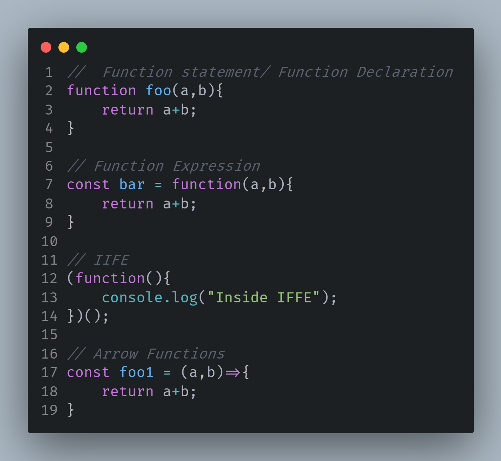

        - **Main and only difference between function declarations and function expression is that `function expression is not hoisted`**
        - **A function that does not have a name is known as `anonymous function`**.For example arrow functions and function expressions are anonymous functions.
        - **`IIFE (Immediately invoked function execution)`** It is type of anonymous function that is executed as soon as it is encountered in the file. This was mostly used before ES6 came out.
    - ## Arguments and Parameters
        - In JS these terms are used interchangeably but if formally if it is in the function body then it is parameter and if it is inside the function call then it is called an argument.
        - `function foo(bar1, bar2){} ` here  `bar1` and `bar2` are `parameters`  

        - `foo(x1,x2)` - calling the function here `x1` and `x2` are `arguments`
    - ## Passing Functions to functions, Callback functions & Higher Order Function
        - 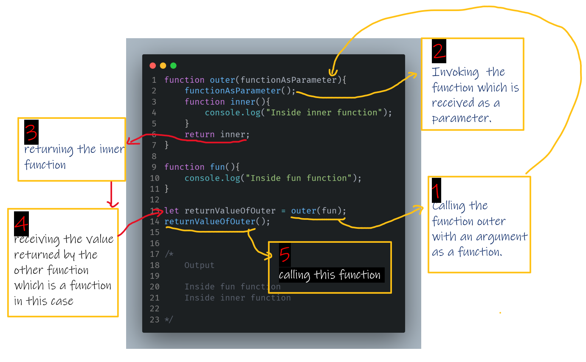
        - **Functions that are passed to other functions as arguments are known as `callback functions`**
        - **Functions that receive callback functions as parameters are known as `higher order functions`**
        - **A function is passed as a callback to function so that it can be executed if some condition satisfies in the higher order function**
    
    - ## Arguments Object and Rest Parameters
        - In JavaScript we can pass any number of arguments to function.

        - When we invoke/call a function with some arguments the function automatically receives an argument object inside the function. **Does not happen in the case of arrow functions. i.e arguments object is not supported by arrow functions**
        - Arguments is an array like object that is it has index and length property but not any of the array functions like map,filter etc.
        - **Arguments object contain all the parameters passed to the function**
        - Example `function foo(a,b){}` 
        - `foo(3,4)`
        - In this case `a=3` and `b=4` and the `arguments` object will contain 3 at index 0 i.e `arguments[0]=3` and similarly `arguments[1]=4`
        - And if we do `a = 8` somewhere inside `foo` function then `arguments[0] = 8` and vice-versa.
        - ### REST Parameters(`...`)
        - Introduced after ES-6
        - Rest parameters used to receive indefinite parameters as an array
        - Syntax `function foo(a,...b)` here b is known as rest parameter and unlike arguments object b will contain only the parameters after the actual parameter. i.e. in this case `b[0]` will not be equal to `a`
        - Another way is `function foo(...a)` here a will contain all the parameter passed to the function inside an array.
    - ## param destructuring 
        - extension of object destructuring
        
        - Used very extensively in react
        - We can destructure the object inside the parameter only 
        - 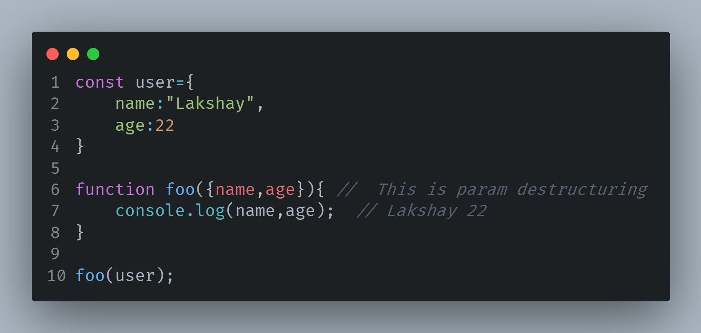
---

- # **JAVASCRIPT BTS**
    - Everything inside Javascript happens in an `Execution Context`.

    - ***JavaScript is a `synchronous single-threaded` language***
    - An Execution Context : 
        |  **Variable Environment** | **Thread of Execution**  |
        |:--- | :---  |
        |  This is the memory space in this variables are   stored as `key:value` pairs and functions are   stored  with there complete codes  (A reference to their whole code)| Here the code executes line by line

    - ## How code actually executes ?
        - Initially an execution context is created.
        
        - And it is created in two phases
            1. Memory Allocation Phase aka. `HOISTING`
            
            2. Code Execution Phase
        - ### Example Code
        - 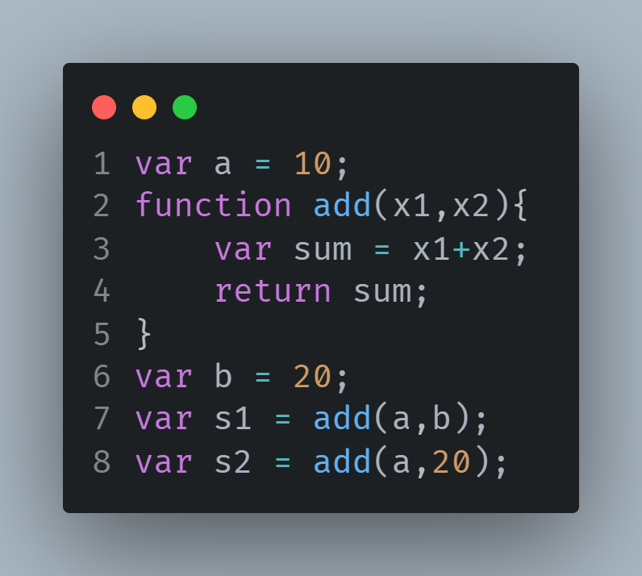
        - **Phase 1**
            - Initially the bowser skims through the code and allocates the memory to all the variables and functions.

            - Variables are set as undefined.
            - Functions are kept with their whole code.(A reference to their whole code)
            - 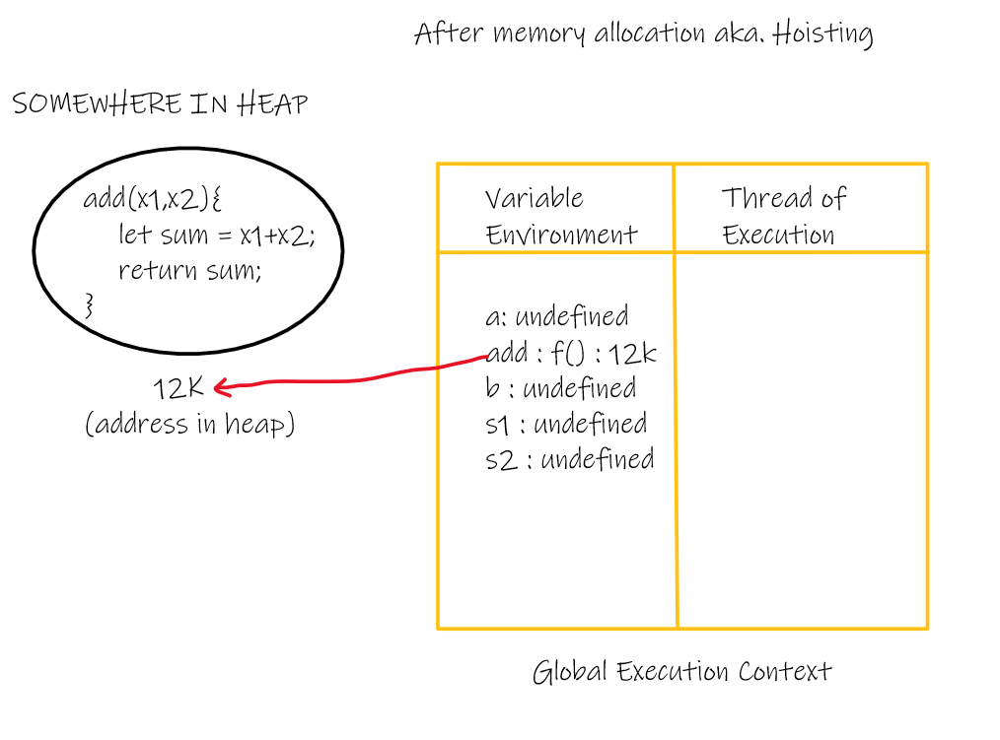
        - **Phase 2**
            
            - Now code will start executing line by line.
                1. As soon as a variable is encounter its value is updated in the variable environment.

                2. As soon as a function is  invoked (i.e function is called) a new Execution Context is created.

            - **A new Execution Context is only created when a function is invoked/called**

            - 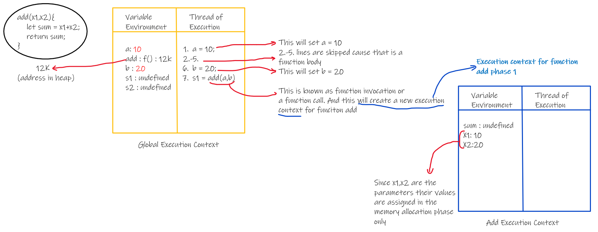

            - 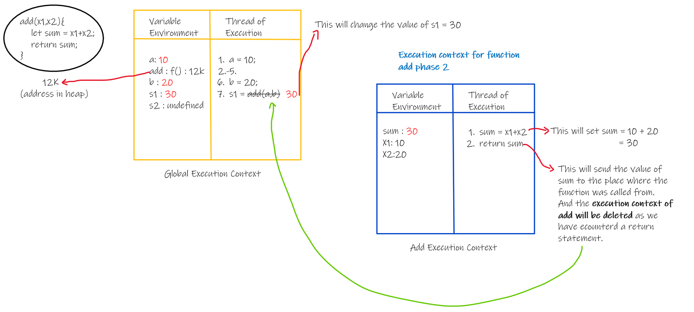

            - 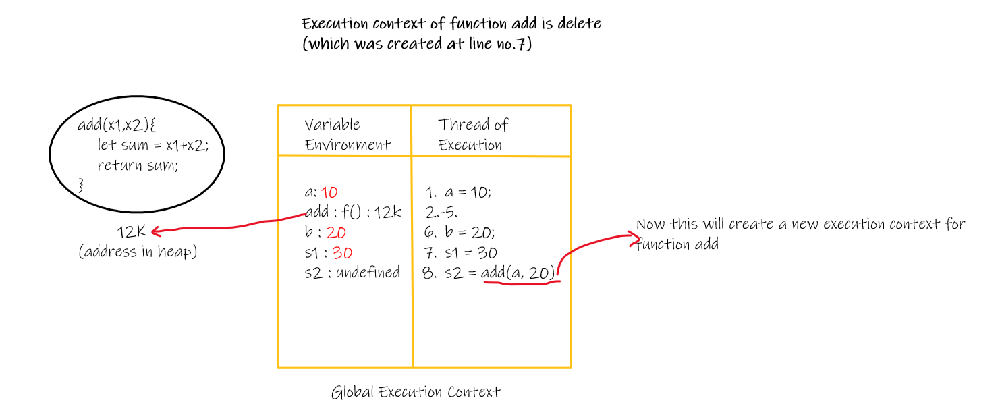

            - **Now like the previous one another execution context will be created for `add(a,30)` at line no.8. And similarly value will be computed for s2 and returned.** 
            - **And finally Global execution context will also be deleted as there is no more code to execute**

    -  ## Call Stack
        - A new execution context is created whenever a function is invoked/called and the control is passed to the new execution context and when the function ends (i.e it returns something or every line inside the function is executed) then the execution context of this function is deleted and control is passed back to where the function was called from.
        - So JavaScript engine manages this creation deletion of execution context and pass of control with the help of a stack and this stack is known as **call stack**. 

        - 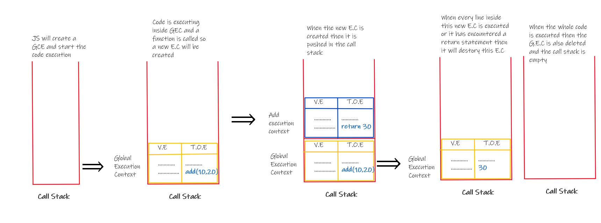

    - Now one can understand that why function expressions are not hoisted because there syntax is like `var add = function(x1,x2){return (x1+x2);}` so while the memory allocation phase JS engine will set as `add : undefined` as it here add is defined as a variable. And until the line where this function is defined is encountered add will be equal to undefined. After that it will be set as the function.

    - ## Scope
        - `{}` - this is known as a block in JS.
        
        - `function f(){var a;}`. There are 2 ways of defining a scope 
            
            1. a is inside the scope of function f(). 
            2. scope of a is function f().
        - Both of these lines means the same thing i.e here **a is accessible anywhere inside function f()** .
        
        - Scope of Var, Let, Const
            - Var has a function scope 
            - Let, Const have a block scope 
            
            - 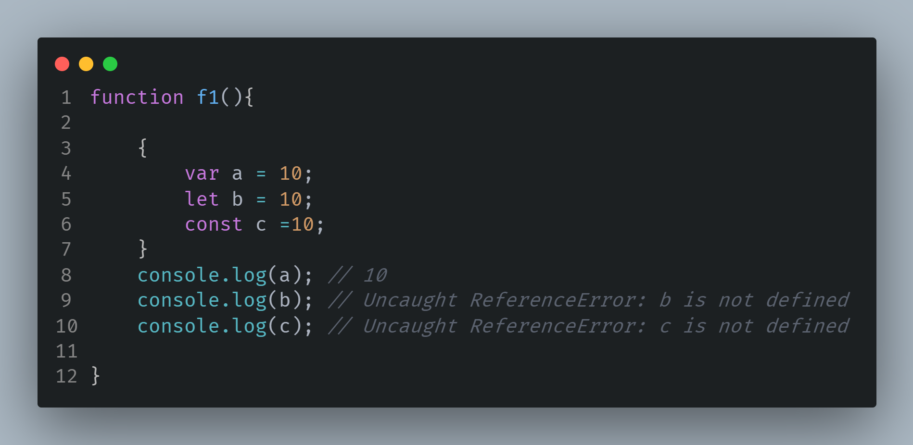
            
    - ## Temporal Dead Zone

        - Let and Const variables are not accessible until they have been initialized.
        
        - 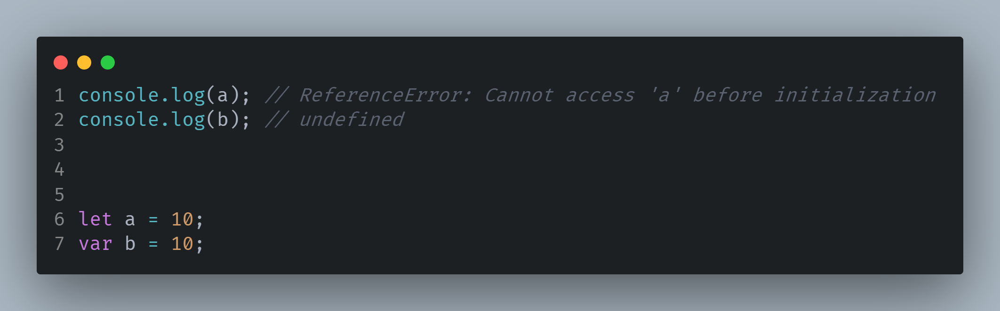
        - Here from line 1 - 5 is the temporal dead zone for a. 
        - That means if we try to access a in this area it throw a reference error
        - So it is a good practice to declare all the let and const variable in the top of the file or function 

    - ## Lexical Environment 
        - A `variable/function` has access to all other variables and functions where the the `variable/function` is defined.
        
        - 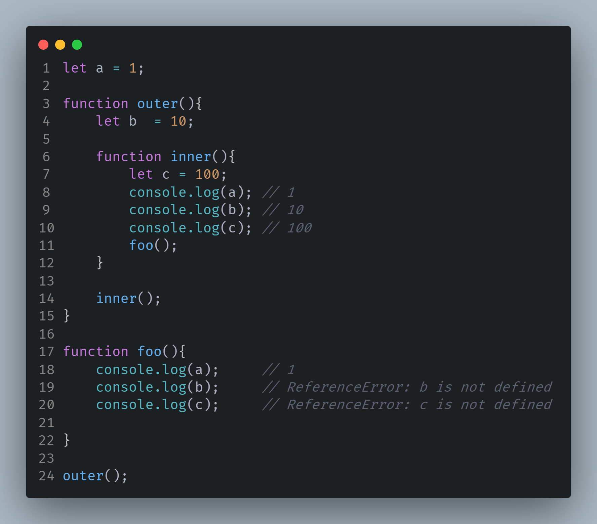
        - In this case the `lexical environment of outer` will contain `function foo` and `let a`. So they can be used anywhere with or inside `outer function`.
        - And `lexical environment of inner` will contain `b`. So `b` can be used anywhere inside function `inner`. inner functions have also access to their outer/parent functions lexical environments. So in simple terms all variables/functions that can be accessed in the `outer function` can also be accessed inside `inner function`.
        - Finally, `lexical environment of function foo()` will contain `a` and `function outer` and hence cannot use `b, c, inner function` inside `foo`.
        
        - **Hence lexical environment is where the function body is present/ where the function is defined and not where the function is called from.**
    
    - ## Scope Chain
        - When a variable is used in JS, the JS engine will try to find the variable’s value in the current scope. 
        - If it could not find the variable, it will look into the outer scope and will continue to do so until it finds the variable or reaches global scope.

    - ## Closure
        - A function bundled with its lexical environment is known as a closure.

        - 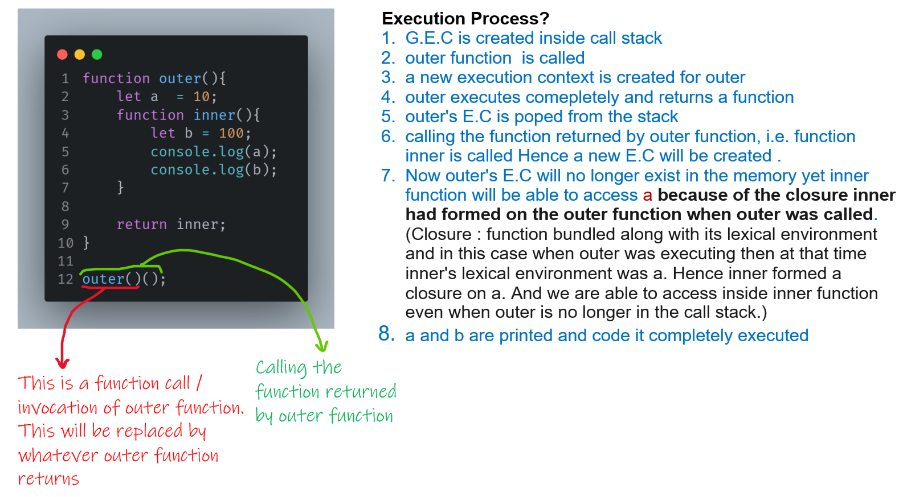
    
    - ## Arrays Again
        - Some more important array methods, these are higher order functions i.e these accept callback functions in the parameters
        - **Very Very important array methods must read**
            - [Some Every](./Arrays/9_some_every.js)
            - [Map](./Arrays/2_maps.js)
            - [Filter](./Arrays/3_filter.js)
            - [Reduce](./Arrays/4_reduce.js)
            - [Union](./Arrays/13_union.js)
            - [Intersection](./Arrays/12_intersection.js)
            - [Try this Question](./Arrays/14_question_and_Sort.js)
        - **Dense Arrays** - Arrays that we use normally are dense arrays
        - **Sparse Arrays** 
            
            - In simple terms arrays with holes is known as sparse array.
            - In Javascript typeof array is object. And to check if an array is actually an array `Array.isArray()` is used.
            - So, in arrays `arr["100"] ` is same as `arr[100]`.
            - Since an array is an object we can do something like - 
            - `let arr = [];` `arr[100] = "🚀";` then this will add `"🚀"` at the 100th index in the array and elements from 0-99 will be undefined.
            - Here `arr.length = 101`
            - This is an example sparse array.
            - How to check if an array is a spares array or not?
            - 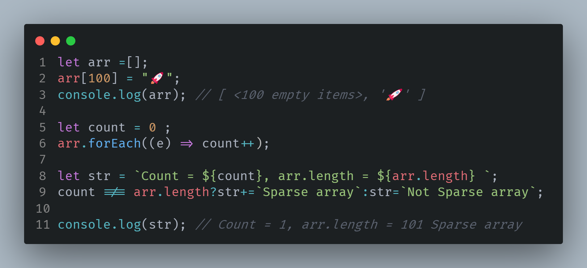 

    - ## Set
        - A set is used to store unique values
        - It has no index, length property and order of the items stored is also not maintained 
        
        - `const ids = new Set([1,2,3,4,5,5,5]);` 
        - Since a set is used to store only unique values `ids` will contain `[1,2,3,4,5]`
        - We can use a `for of` loop to iterate over the elements in set 
        - Set has methods like [add](https://developer.mozilla.org/en-US/docs/Web/JavaScript/Reference/Global_Objects/Set/add) which is used to add a new element in set.
        - Also a method [has](https://developer.mozilla.org/en-US/docs/Web/JavaScript/Reference/Global_Objects/Set/has) which returns true if element with the specified value exists in it. 
        - typeof Set is Object

    - ## Iterables 
        - Data types on which we can use for of loop 
        - Eg. arrays, strings, sets

        - **Objects are NOT iterables**
    
    - ## Array like objects - JS Technical term
        - Data types that has length property and are index accessible
    
    - ## Objects Again 
        - Since objects are reference data types if do `obj1 = obj2` and add some property in `obj1` like `obj1.temp="21";` the it will also be reflected in the `obj2`
        
        - So How to Clone Objects ? 
           
           - We can clone objects using spread operators, similar to that of arrays like `obj2 = {...obj1}`. 

           - Other method is using `obj2 = Object.assign(obj1)` 

        - ### Optional Chaining 

            - [Optional Chaining Video](https://youtu.be/v2tJ3nzXh8I?t=378) - 6 min video 

            - [Optional Chaining Article](https://javascript.info/optional-chaining) - 4 min read  
        
        - ### Methods
            - Functions inside objects are called methods

    - ## `this`

        - `this` is a keyword in JavaScript.
        
        - Its value depends on where it is called from/ where it is being used.
        - this behaves differently with arrow functions than other functions and hence is rarely used inside arrow functions  
    
        - In normal mode        
        -   | where is this used                                        | value of this                                     |
            | :---                                                      | :---                                              |
            |  in the global code                                       | window object                                     |
            |  inside a function                                        | window object                                     |
            |  inside a method(i.e a function inside an object)         | object that is used to call  method/ object itself|
            |  inside a function that is inside a method                | window object                                     |
        
        - In strict mode
        -   | where is this used                                        | value of this                                     |
            | :---                                                      | :---                                              |
            |  in the global code                                       | window object                                     |
            |  inside a function                                        | undefined                                         |
            |  inside a method(i.e a function inside an object)         | object that is used to call  method/ object itself|
            |  inside a function that is inside a method                | undefined                                         |

    - ## Functions Again
        - Functions in JS are very different then functions in other languages.
        
        - Functions have there own methods defined just like there are methods defined for arrays.
        - Most important and very commonly used methods are `call()`,`apply()`,`bind()`;
        - Now these 3 methods are used to change the default value of `this`. When calling obj methods.

        - 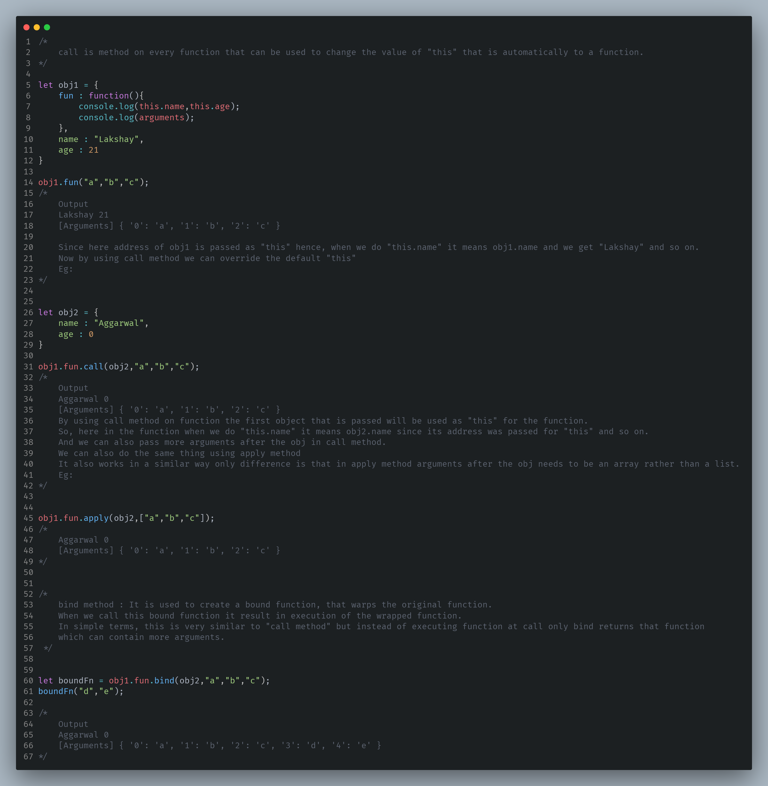  

        - ### Constructor Functions
            
            - If we need to create multiple objects having same properties, a constructor function is used.
            
            - 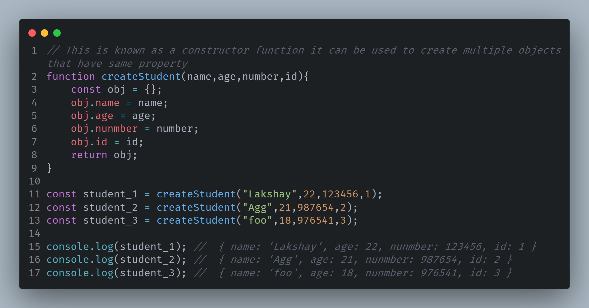
        
        - ### Inheritance 
            
            - In JS it is also possible to use methods of one object in another if we inherit from it. Because of this only we are able to use all these different kinds of functions on arrays/strings/set, etc. What I mean here is that lets suppose an array `let arr = ["🚀","🍏","🍎"]` then we are able to do `arr.map()`, `arr.filter()` and all the other methods as here arr inherit from `Array` internally in JS. 
            
            - Similarly we can also create objects that can inherit methods and variables of other objects by using **`Object.create()`**, we can pass an obj inside it and it will set that object(which has been passed as a parameter) as sort of a parent to the current obj. ( *Known as [[prototype]] in JS* ).
            - Eg `let obj = Object.create(obj1)` , then we will be able to use all the methods and variable of obj1 in obj.

            - 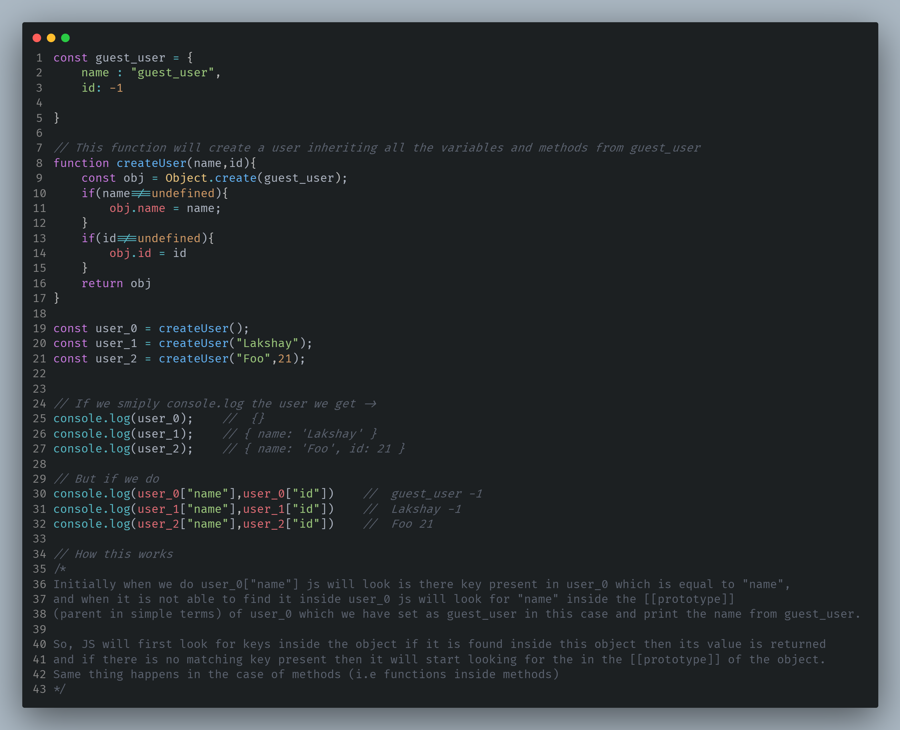

---

- # **Asynchronous JavaScript**
    - **JS is single threaded synchronous language**.
    
    - 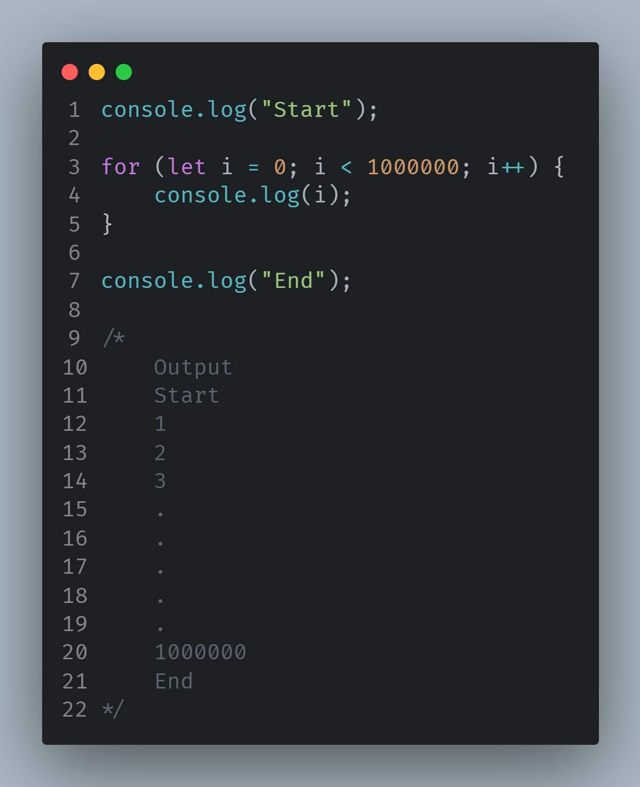
    - By this we know that JS is synchronous language.
    - Which means that JS runs from top to bottom

    - ## setTimeout and clearTimeout
        
        - `setTimeout()` is a function which takes a callback function and time(in milliseconds) as the parameters and it will call this callback function after the time expires. The time passed in the setTimeout is the minimum time after which call to the function will be made and not a fixed time after which the function call is made.

        - Now setTimeout() is function which is provided by the bowser to us and not JS.
        - setTimeout() is also an async function, which means it will not block the flow of the code, Hence we cannot use setTimeout to pause the execution of the code for some amount of time if want to.

        - **How setTimeout() Works ?**
        
        - 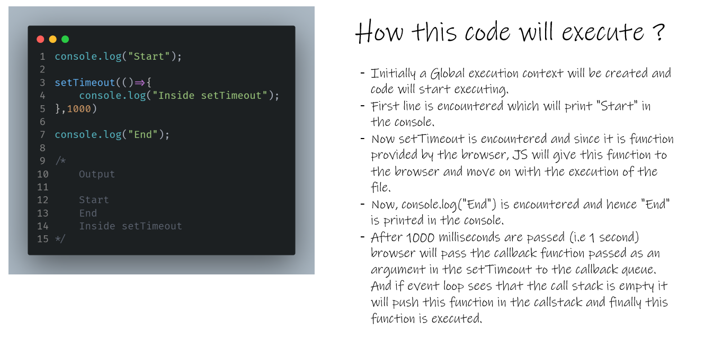
        
        - 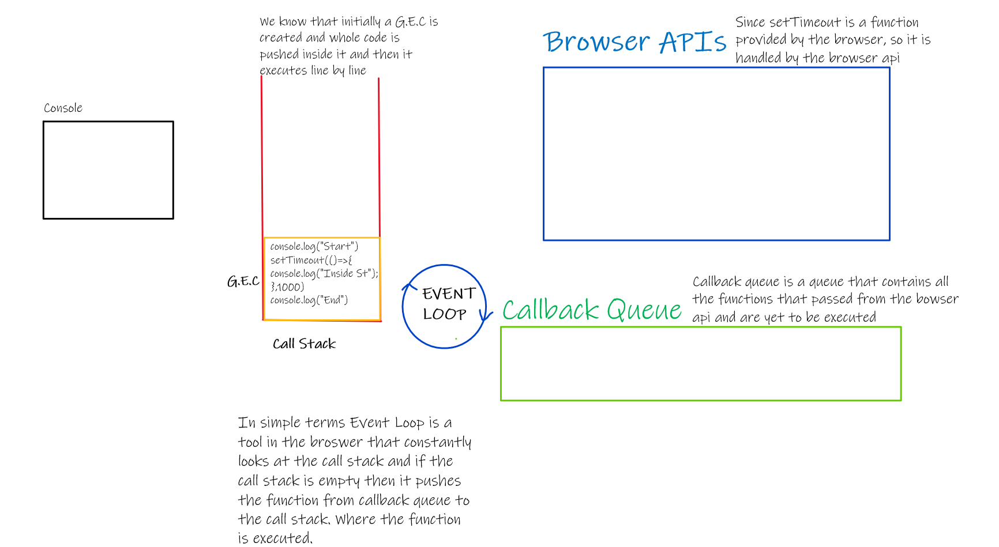
        - 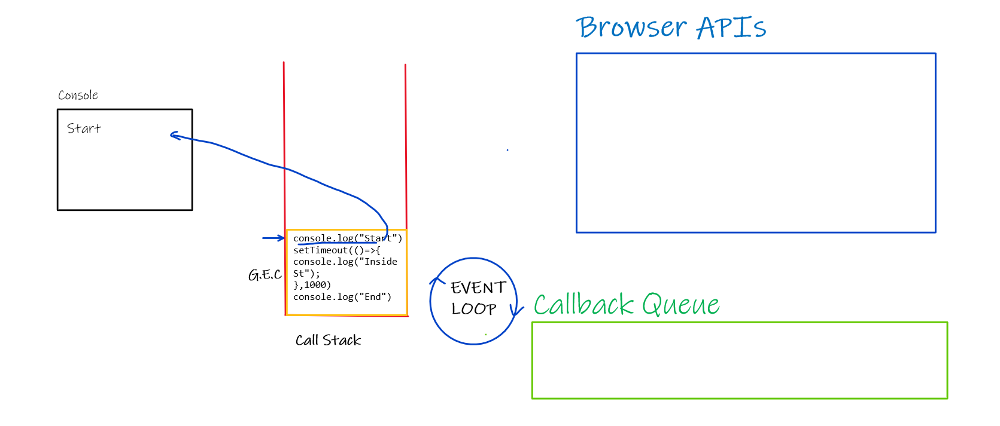
        - 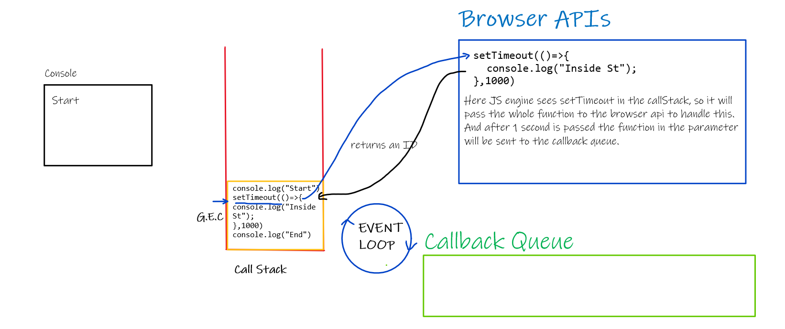
        - 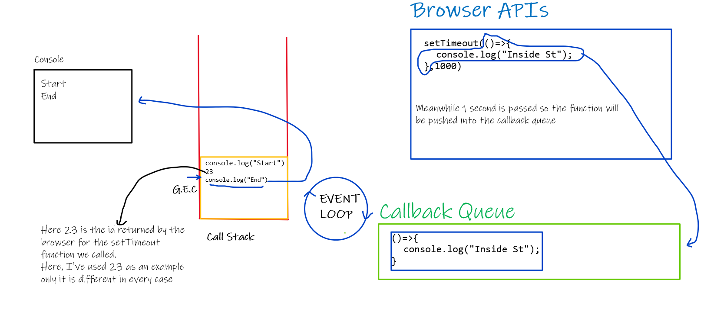
        - 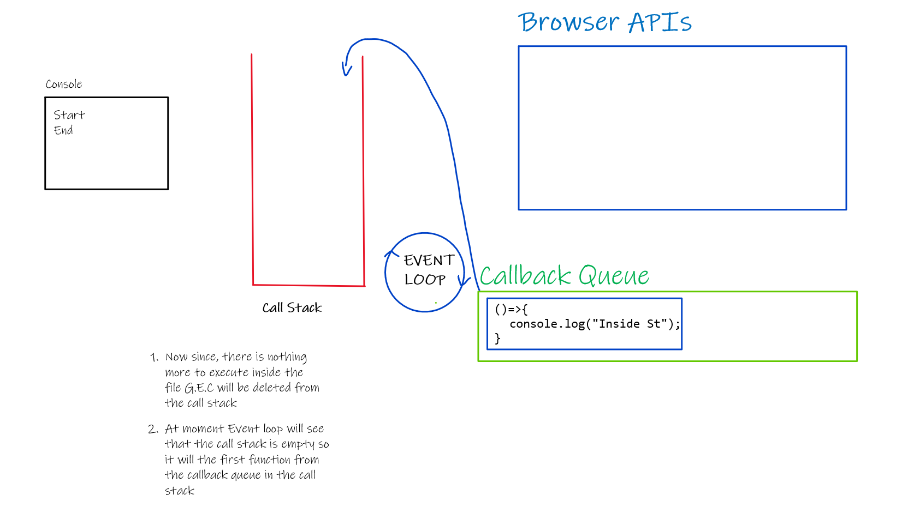
        - 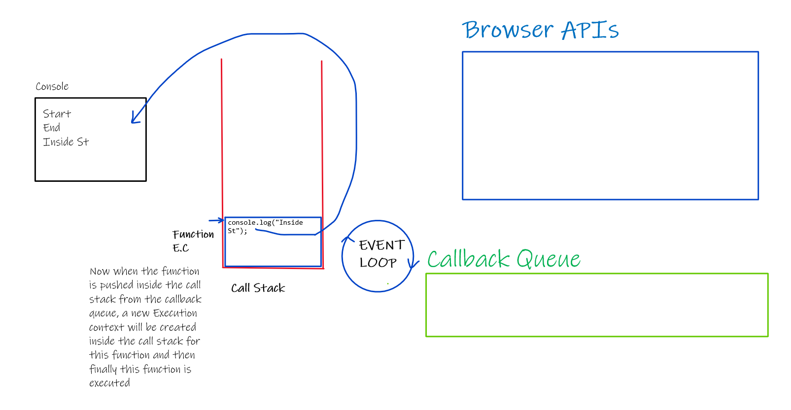
        - 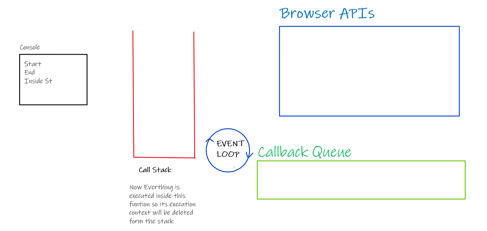

        - With this, we now know that the time passed in the setTimeout is the time after which the callback function will be added in the callback queue and the function will execute when function is moved from **callback queue** to **call stack**.
        - Now, this is the reason that in setTimeout the time passed is the minimum time to execute the function and not the absolute time. As the function will only be executed when the **event loop** sees the call stack empty and then function is pushed from **callback queue** to **call stack** where it finally executes.
        - Therefore, a **setTimeout() with 0ms time** will also execute after the whole script is executed as the function will be passed to the callback queue and will have to wait there until the call stack is empty. And call stack would be empty only when the whole script is executed.

        - When a setTimeout is called it returns an id as I've shown in the above example, the use of this id is to clear this timeout. i.e the function which was passed as a parameter in setTimeout will be deleted from the callback queue only. And it will not be executed.

        - 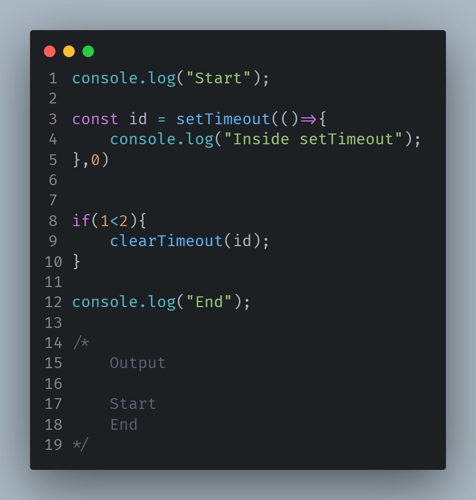
        - In this code the if(1<2) is a mock condition, in practical applications there might be a case where one doesn't require the function passed in setTimeout to execute anymore so clearTimeout can be used to do so.

    - ## setInterval and clearInterval
        
        - `setInterval()` works very similar to `setTimeout()`.
        - setInterval() also returns an id when called
        
        - Like in `setTimeout()` , `setInterval()` is also a function provided by the browser. Only difference is that setTimeout pushes the function in callback queue only once after the time is expired, whereas in setInterval will push the function in the callback queue after every time interval. For eg consider a `setTimeout(fun,5000)` and a `setInterval(fun,5000)` in this case `setTimeout` will push function fun in the callback queue after 5 Seconds only once where as `setInterval` will push the function fun in the callback queue after every 5 Seconds are passed. And to stop this is clearInterval is used.
    
    - ## callbacks in detail
         
        - Callbacks are function that passed to other functions as parameters.  

        - 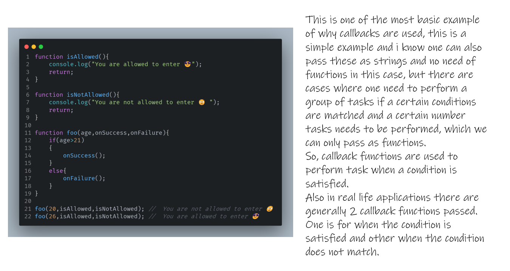
        - Other use of callback is to control the flow the code in a program.
        
        - ### Callback Hell 
            
            - When we use callback function in a nested way it is known as a callback hell (i.e callback inside callback inside callback and so on)
            - Most simple I could think of, a function which prints the value of variable x and updates it by a factor one after every second and if at any point it is less than 5 it prints value is less than 5.

            - 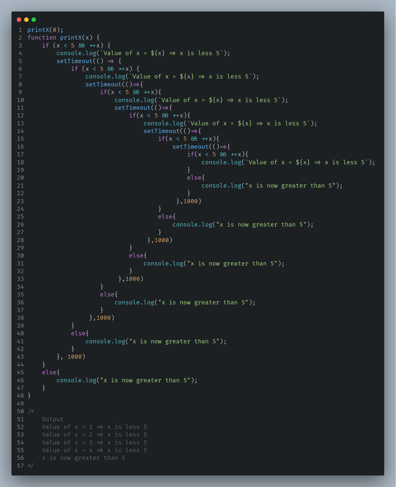 

            - Also, if you rotate this image by 90 to the left it resembles a pyramid structure, hence it is also known as **pyramid of doom**.
            - [A more practical example on pyramid of doom](https://github.com/harshitvee/javascript-beginning-to-mastery/blob/main/part3/asynchronous-javascript/133.js#:~:text=changeText(heading1%2C%20%22one%22%2C%22violet,Heading1%20does%20not%20exist%22)%7D))